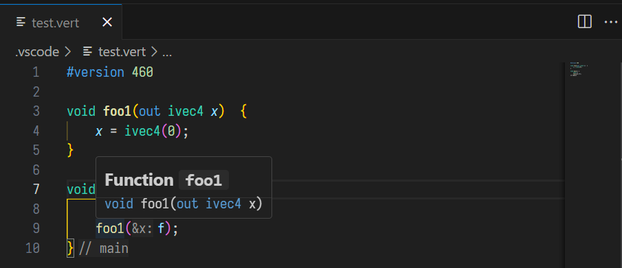

# GLSLD
GLSLD is a language server for the OpenGL Shading Language. This is a project in its an early development cycle. The extension may not work from time to time. The extension only ships with the windows binary at the moment.

The actualy language server is implemented at [GLSLD](https://github.com/daiyousei-qz/glsld).

The extension icon is generated by ChatGPT :)

# Supported Feature

### Semantic Tokens

### Document Symbol

### Hover

### Code Completion

### Inlay Hint

### Signature Help

### Reference

### Goto Declaration